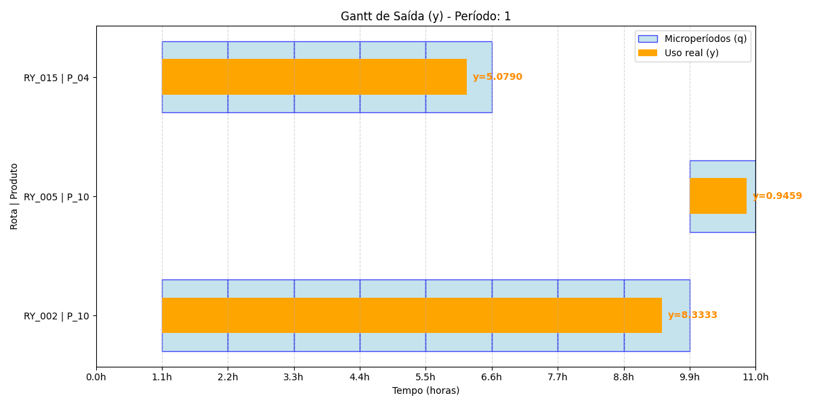

<!--
<script type="text/x-mathjax-config">
  MathJax.Hub.Config({
    tex2jax: {
      inlineMath: [['$','$'], ['\\(','\\)']],
      displayMath: [['$$','$$'], ['\\[','\\]']],
      processEscapes: true
    }
  });
</script>

<script type="text/javascript" async
  src="https://cdn.jsdelivr.net/npm/mathjax@3/es5/tex-mml-chtml.js"></script>
-->

<style>
/* ============================================================
   ESTILOS GLOBAIS PARA BLOCO DE CÓDIGO (pre / code)
   - Unifica tamanho, espaçamento e altura de linha em toda a apresentação.
   - Aplica-se a todos os blocos <pre><code> e também ao highlight.js (.hljs).
   ============================================================ */

/* Bloco <pre> inteiro */
pre {
    padding: 4px 10px !important;   /* reduz drasticamente o padding vertical */
    margin: 0.5em 0 !important;     /* margem equilibrada acima/abaixo */
    line-height: 1.15 !important;   /* altura de linha compacta */
    background: #f5f5f5;            /* (opcional) fundo suave, se quiser */
    border-radius: 4px;             /* (opcional) arredondamento */
    overflow-x: auto;               /* mantém a rolagem horizontal se necessário */
}

/* O código dentro do bloco <pre> */
pre code {
    font-size: 0.7em !important;   /* tamanho legível (0.65em do tamanho base) */
    line-height: 1.15 !important;   /* mesmo valor do <pre> */
    display: block;                 /* ocupa a largura total */
    font-family: 'Courier New', monospace; /* (opcional) fonte monoespaçada */
}

/* Para quem usa highlight.js (comum no Marpit) */
.hljs {
    padding: 4px 10px !important;
    line-height: 1.15 !important;
    background: transparent !important; /* herda o fundo do <pre> */
}

/* Para código inline (dentro do parágrafo) – mantém pequeno, mas não tão minúsculo */
code:not(pre code) {
    font-size: 0.7em !important;   /* um pouco maior que o antigo 0.42em */
    background: #f0f0f0;
    padding: 0.1em 0.3em;
    border-radius: 3px;
}
</style>

# Comparativo de Implementações do João e do Diego

---

## Roteiro

1. Inconsistências na geração de instâncias do João;
2. Inconsistências na implementação da restrição de não-sobreposição de rotas do João;
3. Problemas da restrição do balanceamento de estoques do João;
4. Problemas da restrição de limitação do escoamento ao estoque do João;

-   Que inibe o pipe simultâneo entre rota de entrada e rota de saída.

---

## Roteiro

5. Adição da restrição de limitação da recepção de minérios à diferença da capacidade de uma subárea $s$ no instante $t$ menos o estoque dessa subárea no começo do período, ou seja, em $t - 1$;
6. Impossibilidade de reprodução exata dos experimentos pela descaracterização do poliedro de soluções
7. Comparativo de resultados entre as implementações do João e do Diego;
8. Conclusão.

---

<style scoped>
/* 
   Centraliza a tabela e reduz a altura das linhas
*/
p, li, td, th {
    font-size: 0.7em;
}

table {
    display: block;
    margin: 0 auto;
    width: 45%;
}

th, td {
    text-align: center;
    vertical-align: middle;
    padding: 0.1em 0.6em;      /* Altura reduzida */
    line-height: 1.2;          /* Menos espaço entre linhas de texto */
}
</style>

## 1. Inconsistências na geração de instâncias do João

Vamos analisar um conjunto de rotas de entrada para um cenário de 10 rotas de entrada num porto com 2 viradores ($\text{CDI}$), 2 esteiras ($\text{CBI}$) e 2 empilhadeiras ($\text{SRI}$).

| Rota     | Caminho                                     |
| -------- | ------------------------------------------- |
| `RX_001` | `['CD_001', 'CBI_001', 'SRI_001', 'S_001']` |
| `RX_002` | `['CD_001', 'CBI_002', 'SRI_002', 'S_002']` |
| `RX_003` | `['CD_001', 'CBI_001', 'SRI_001', 'S_003']` |
| `RX_004` | `['CD_001', 'CBI_002', 'SRI_002', 'S_004']` |
| `RX_005` | `['CD_001', 'CBI_001', 'SRI_001', 'S_005']` |
| `RX_006` | `['CD_002', 'CBI_002', 'SRI_002', 'S_006']` |
| `RX_007` | `['CD_002', 'CBI_001', 'SRI_001', 'S_007']` |
| `RX_008` | `['CD_002', 'CBI_002', 'SRI_002', 'S_008']` |
| `RX_009` | `['CD_002', 'CBI_001', 'SRI_001', 'S_009']` |
| `RX_010` | `['CD_002', 'CBI_002', 'SRI_002', 'S_010']` |

Pelo enunciado do problema, qualquer rota é conflitante quando existe compartilhamento de máquinas entre elas.

---

<style scoped>
    p {
        font-size: 0.7em;
    }
</style>

## 1. Inconsistências na geração de instâncias do João

O joão faz um cálculo de rotas conflitantes à partir de uma matriz de uso de equipamentos por rotas, mas, ela é codificada a para ter $|M_{x}|$ equipamentos linhas e $\frac{|M_{x}|}{2}$ colunas. Então, existem casos de rotas que não serão associadas aos equipamentos que deveriam, como a rota `RX_005`, que deveria ser associada ao equipamento `CD_001`. Ainda mais, existem casos de rotas faltando equipamentos (`RX_009` por exemplo) ou sem quaisquer equipamentos vinculados como a `RX_010`. Segue um excerto da matriz reproduzido exatamente como na instância do João, que demonstra essa inconsistência:

```
Subconjuntos de rotas x que utilizam o equipamento m := rotaXm[equipamento][rota];
	equip. 1: 1  2  3  4
	equip. 2: 6  7  8  9
	equip. 3: 1  3  5  7
	equip. 4: 2  4  6  8
	equip. 5: 1  3  5  7
	equip. 6: 2  4  6  8
```

**Observação:** `equip. 1 = CD_001`, `equip. 2 = CD_002`, `equip. 3 = CBI_001`, `equip. 4 = CBI_002`, `equip. 5 = SRI_001`, `equip. 6 = SRI_002`

---

<style scoped>
    p {
        font-size: 0.7em;
    }
</style>

## 1. Inconsistências na geração de instâncias do João

```
Subconjuntos de rotas x que utilizam o equipamento m := rotaXm[equipamento][rota];
	equip. 1: 1  2  3  4
	equip. 2: 6  7  8  9
	equip. 3: 1  3  5  7
	equip. 4: 2  4  6  8
	equip. 5: 1  3  5  7
	equip. 6: 2  4  6  8
```

**Observação:** `equip. 1 = CD_001`, `equip. 2 = CD_002`, `equip. 3 = CBI_001`, `equip. 4 = CBI_002`, `equip. 5 = SRI_001`, `equip. 6 = SRI_002`

Se uma rota não está nessa matriz, mas deveria, então, na hora de avaliar conflitos o solver passa a considerar aquela rota como não conflituosa com alguma que deveria ser e isso é um problema. A rota 5, por exemplo, deveria estar associada ao equipamento 1 — e conflitar com as demais associadas à ele — mas não está. A rota 9 está associada apenas ao equipamento 2, sem esteira e empilhadeira, portanto. Por fim, se observarmos, não existe nenhuma ocorrência da rota 10 nessa matriz, a rota 10 existe para o solver mas não tem nada associado à ela!

---

<style scoped>
/* 
   Centraliza a tabela e reduz a altura das linhas
*/
h2 {
    font-size: 1em;
}

p, li, td, th {
    font-size: 0.7em;
}

table {
    display: block;
    margin: 0 auto;
    width: 45%;
}

th, td {
    text-align: center;
    vertical-align: middle;
    padding: 0.05em 0.45em;      /* Altura reduzida */
    line-height: 1;          /* Menos espaço entre linhas de texto */
}
</style>

## 1. Inconsistências na geração de instâncias do João

Com isso, o conjunto de rotas conflitantes é inconsistente com a realidade operacional do problema. Reproduzindo esta mesma instância na minha formulação consistente, o cojunto abaixo representa a diferença entre os meus conjuntos e os do João, que não foram considerados na implementação dele:

**Rotas conflitantes não consideradas pelo João**

| Rota x                 | Rota y                 |
|------------------------|------------------------|
| `('RX_001', 'RX_009')` | `('RY_001', 'RY_010')` |
| `('RX_002', 'RX_005')` | `('RY_003', 'RY_010')` |
| `('RX_002', 'RX_010')` | `('RY_005', 'RY_010')` |
| `('RX_003', 'RX_009')` | `('RY_007', 'RY_010')` |
| `('RX_004', 'RX_005')` | `('RY_009', 'RY_010')` |
| `('RX_004', 'RX_010')` | `('RY_011', 'RY_020')` |
| `('RX_005', 'RX_009')` | `('RY_013', 'RY_020')` |
| `('RX_006', 'RX_010')` | `('RY_015', 'RY_020')` |
| `('RX_007', 'RX_010')` | `('RY_017', 'RY_020')` |
| `('RX_008', 'RX_010')` | `('RY_019', 'RY_020')` |
| `('RX_009', 'RX_010')` |                        |

**O que implica que a formulação considera essas combinações como válidas para operação mútua, o que não reflete a realidade operacional do problema.**

---

<style scoped>
    p {
        font-size: 0.7em;
    }
</style>

## 2. Inconsistências na implementação da restrição de não-sobreposição de rotas do João

Também existem problemas na implementação da restrição de não-sobreposição de rotas do João. A formulação da dissertação, como já discutimos nas reuniões passadas, deixou passar a possibilidade de rotas conflitantes transportarem mutuamente produtos distintos, só que o João tentou consertar isso na implementação do código, mas, do jeito que fez, não consegue, como eu vou demonstrar nos excertos das restrições `r_446_1` e `r_446_2` que seguem nos próximos slides.

---

<style scoped>
    p {
        font-size: 0.7em;
    }
</style>

### 2. r446\_1


```cpp
    /// *restricao 4.46 ou restricao mod 3*
    for ( int p = 1; p < produtos; p++){
        for ( int t = 1; t < periodos; t++){
            for ( int r = 0; r < nLin_rtCE; r++){
                for ( int i = 0; i < microperiodos; i++){
                    IloExpr r446_1(env);
                    r446_1 = q[rotaCompEquip[r][0]-1][p][i][t] + q[rotaCompEquip[r][1]-1][p][i][t];
                    IloConstraint c (r446_1 <= 1);
                    c.setName("restrNSeq5(1)");
                    mod.add(c);
                    r446_1.end();
                }
            }
        }
    }
```

Aqui ele implementa que rotas conflitantes `rotaCompEquip[r][0]-1]` e `rotaCompEquip[r][1]-1]` não podem transportar o mesmo produto `p` no mesmo microperíodo `i` do período `t`. Mas, ele não impede que essas rotas transportem produtos distintos.

---

<style scoped>
    p {
        font-size: 0.7em;
    }
</style>

### 2. r446\_2

Ele vem tentar contornar isso na restrição `r_446_2`, que é a seguinte:

```cpp
    for ( int t = 1; t < periodos; t++){
        for ( int r = 0; r < nLin_rtCEr; r++){
            for ( int i = 0; i < microperiodos; i++){
                IloExpr r446_2(env);
                r446_2 = q[rotaCompEquipProd[r][0]-1][rotaCompEquipProd[r][1]][i][t] + q[rotaCompEquipProd[r][0]-1][rotaCompEquipProd[r][2]][i][t];
                IloConstraint c (r446_2 <= 1);
                c.setName("restrNSeq6(2)");
                mod.add(c);
                r446_2.end();
            }
        }
    }

```

---

<style scoped>
    p {
        font-size: 0.65em;
    }
</style>

## 2. Inconsistências na implementação da restrição de não-sobreposição de rotas do João

Só que observem, a restrição é inócua para o propósito buscado, de tentar impedir que rotas conflitantes transportem produtos distintos, pois, na indexação de `q`, que por padrão é `q[r][p][i][t]`, ele repete o índice `rotaCompEquipProd[r][0]-1]` para os dois `q`, ou seja, ele apenas impede que a mesma rota `r` transporte dois produtos distintos que ele considerou como conflitantes, representados respectivamente por `rotaCompEquipProd[r][1]` e `rotaCompEquipProd[r][2]`, Só que, novamente, esse caso não impede que rotas distintas conflitantes transportem produtos distintos.

Vou explicar melhor, sob a perspectiva de rotulação de variáveis. Consideremos:

```cpp
    int r = rotaCompEquipProd[r][0]-1];
    int r_linha = rotaCompEquipProd[r][0]-1];
    int p = rotaCompEquipProd[r][1];
    int p_linha = rotaCompEquipProd[r][2];
    r446_2 = q[r][p][i][t] + q[r_linha][p_linha][i][t];
    IloConstraint c (r446_2 <= 1);
    if (r == r_linha) {
        cout<<"A restrição está inócua, atuando sobre a mesma rota, e não sobre rotas distintas"<<endl;
    }
```

---

<style scoped>
    p {
        font-size: 0.65em;
    }
</style>

## 2. Inconsistências na implementação da restrição de não-sobreposição de rotas do João

Eu testei no solver e de fato, ocorreram conflitos, $q$ foi setado como $1$ em casos onde não deveria, justamente em rotas confltantes transportando produtos distintos, como também nas rotas negligenciadas pela geração de instâncias do João. Eu construí ferramentas de verificação de conflitos para analisar as soluções, tanto as minhas quanto as dele, e aqui está um excerto da execução delas:

**Conflitos da formulação do João:**

```
============================================================
        RELATÓRIO OFICIAL DE AUDITORIA DE CONFLITOS         
============================================================

[ ALERTA ] REPROVADO: Foram encontrados 76 conflitos!

--- PERÍODO 1 ---
Micro 04 | [TOPOLÓGICO]       RX_005 (P_01) rodando junto com RX_001 (P_02)
Micro 04 | [TOPOLÓGICO]       RX_005 (P_01) rodando junto com RX_002 (P_07)
...
```

---

Já nas duas primeiras linhas do relatório ela já caracteriza os dois tipos de conflitos possíveis:

1. Rotas que a implementação do João considera como conflitantes — `RX_001` e `RX_005` — transportando `P_01` e `P_02` ao mesmo tempo.
2. Rotas que a implementação negligenciou na matriz de uso de equipamentos — `RX_005` e `RX_002` — transportando `P_01` e `P_07` ao mesmo tempo.

---

<style scoped>
    p {
        font-size: 0.8em;
    }
</style>

## Mitigação dos cenários 1 e 2.

### Cenário 1 - Rotas conflitantes não mapeadas na instância do João

- Desde o começo da minha implementação, a geração das minhas instâncias é imune aos problemas descritos no caso 1 por ter seguido uma metodologia distinta da do João, baseada em conjuntos matemáticos e filtros funcionais. Eu criei um filtro funcional que dado uma rota qualquer, mapeia todas as máquinas alcançadas por ela.
  - Iterando para cada $r \in R$ e depois, para cada $r^\prime \in R \setminus \{r\}$, filtro $M_{r} \cap M_{r^\prime}$ e se esse conjunto for não-vazio, então, adiciono a tupla $(r, r^\prime)$ ao conjunto de rotas conflitantes $E$.
  - O custo dessa operação é $O(|R|^2 \cdot |M|)$, mas, ela é garantida para gerar um conjunto consistente.

---

<style scoped>
    p {
        font-size: 0.8em;
    }
</style>

## Mitigação dos cenários 1 e 2.

### Cenário 2 - Rotas conflitantes transportando produtos distintos.

A questão é que para toda rota $r$ em qualquer período $t$ e em qualqer microperíodo $i$, apenas um único produto $p$ pode ser transportado nessa rota $r$ e se $r$ for conflitante a alguma $r^\prime$ qualquer, então, $r^\prime$ não pode fucionar enquanto $r$ funciona e vice-versa.

Eu consigo garantir isso com a seguinte restrição:

$$
\begin{align*}
    \sum_{p \in P} q_{r, p, t, i} + \sum_{p \in P} q_{r^\prime, p, t, i} \leq 1 \qquad \forall \langle r, r^\prime \rangle \in E, \forall t \in T, \forall i \in I
\end{align*}
$$

Pois ela garante que para cada $r$ e $r^\prime$ conflitantes, apenas um único produto pode ser transportado por apenas um deles no mesmo instante $i$ do período $t$.

---

<style scoped>
    p, li {
        font-size: 0.7em;
    }
</style>

### Considerações sobre rotas conflitantes

- Do jeito que o João implementou, $q_{r, p, t, i} = 1$ não garante necessariamente que $r$ será usada para escoar $p$ no instante $i$ do período $t$, mas, se $x_{r, p, t} > 0$ ou $y_{r, p, t} > 0$, obrigatoriamente deve existir algum $q_{r, p, t, i} = 1$ para algum $i \in I_T$ no período $t$.
- No caso do João, mesmo que o solver setasse para poder transportar produtos sobre rotas conflitantes, assim, na solução final, ele poderia escolher passar por rotas que não conflitam, entretanto, poderia passar sobre rotas que conflitam também, por isso, da forma como está, não existem garantias!

---

<style scoped>
    p, li {
        font-size: 0.8em;
    }
</style>

### Considerações sobre rotas conflitantes

- Outro potencial problema, é que como a restrição $r446\_2$ atua sempre sobre as mesmas rotas, já que ela usa a mesma variável como índice de rota, então, ela acaba como um limitador do escoamento ao impor que uma mesma rota não possa transportar produtos da matriz `rotaCompEquipProd`.
  - Isso pode e deve elevar o custo da operação, já que o solver atua restringindo os produtos que podem ser transportados em rotas para além do necessário.

**Apesar da reprodução exata de resultados entre as implementações agora ter perdido sentido, por tratarem de poliedros distintos, vamos comparar os resultados delas ao fim dessa apresentação.**

---

# 3. Problemas da restrição do balanceamento de estoques do João

---

<style scoped>
    p, li {
        font-size: 0.8em;
    }
</style>

## 3. Problemas da restrição do balanceamento de estoques do João

O balanceamento de estoques do João é ancorado no futuro, o que implica que o estoque em $t+1$ depende do que entra ($x$) e do que sai ($y$) no período $t$:

$$
e_{s, p, t + 1} = e_{s, p, t} + \sum_{\text{rx} \in R_{x}^{s}} c^{\text{rx}} x_{\text{rx}, p, t} + \sum_{\text{ry} \in R_{y}^{s}} c^{\text{ry}} y_{\text{ry}, p, t} \qquad \forall s \in S, \forall p \in P, \forall t \in T
$$

Entretanto, como $T = \{1, 2, \ldots, |T|\}$, então, $e_{s, p, 1}$ não está vinculado à ninguém - é uma variável livre na restrição - e isso permite o que ao solver? Que ele aloque valores nessa variável, de acordo com a conveniência para minimizar a função objetivo à revelia da consistência física do modelo.

---

<style scoped>
    h2 {
        font-size: 0.8em;
    }
    p, li {
        font-size: 0.6em;
    }
</style>

## 3. Problemas da restrição do balanceamento de estoques do João

Para coibir isso sem mexer na restrição, deveríamos considerar $T = T \cup \{0\}$, mas, na implementação do João, ele não fez isso:

```cpp
    for( int s = 0; s < subareas; s++){
        for (int p = 1; p < produtos; p++){
            for ( int t = 1; t < periodos; t++){
                IloExpr r44(env);
                for (int r = 1; r < nCol_rtXs; r++){
                    if ( rotaXs[s][r] != 0){
                        r44 += cr[rotaXs[s][r]-1] * x[rotaXs[s][r]-1][p][t];
                    }
                }
                for (int r = 1; r < nCol_rtYs; r++){
                    if ( rotaYs[s][r] != 0){
                        r44 -= cr[rotaYs[s][r]-1] * y[(rotaYs[s][r]-1)-(rotaX)][p][t];
                    }
                }
                IloConstraint c (r44 + e[s][p][t] - e[s][p][t+1]== 0);
                c.setName("restr4.4");
                mod.add(c);
                r44.end();
            }
        }
    }
```

---

<style scoped>
    h2 {
        font-size: 0.8em;
    }
    p, li {
        font-size: 0.6em;
    }
</style>


## 3. Problemas da restrição do balanceamento de estoques do João

Eu consegui simular exatamente um caso onde no período 1, não havendo qualquer estoque de qualquer produto na subárea 1, o solver setou $e_{1, 10, 1} = 100000$, convenientemente, porque a variável não estava amarrada a nada, para escoar o produto 10 para um navio que o demandava, como veremos no gantt do próximo slide. Primeiro, confirmemos - pela instância do João, espelhada na minha - os estoques iniciais de cada subárea e produto:

```
Estoque Inicial
    subarea 0 := 0	0	0	0	0	0	0	0	0	0	0	
    subarea 1 := 0	0	0	0	0	0	0	0	0	50000	0	
    subarea 2 := 0	0	0	0	0	0	0	0	0	0	50000	
    subarea 3 := 0	0	0	0	0	0	0	0	0	50000	0	
    subarea 4 := 0	0	0	0	50000	0	0	0	0	0	0	
    subarea 5 := 0	0	0	0	0	0	0	0	0	0	50000	
    subarea 6 := 0	0	0	0	50000	0	0	0	0	0	0	
    subarea 7 := 0	0	0	0	50000	0	0	0	0	0	0	
    subarea 8 := 0	0	0	0	0	0	0	0	0	0	50000	
    subarea 9 := 0	0	0	0	0	0	0	0	0	0	0	
```

Verificamos que a subárea 1 (0) não possui qualquer produto armazenado.

---

<style scoped>
    h2 {
        font-size: 0.8em;
    }
    p, li {
        font-size: 0.6em;
    }
    img {
        display: block;
        margin: 0 auto;
        width: 60%;
        height: auto;
    }
</style>

## 3. Problemas da restrição do balanceamento de estoques do João - Gantt da Saída no Primeiro Período



Ao analisar o gráfico, observamos que ele opera a rota `RY_002` por 8.3333 horas para escoar produto `P_010`. Considerando que todas as capacidades das rotas em toneladas por hora são de 12000, então, vemos que essa rota escoou 100000 toneladas de `P_010`. Porém, esta rota está conectada à subárea 1, que não possui qualquer produto armazenado, mas, como $e_{1, 10, 1}$ não estava amarrado a nada, o solver setou convenientemente esse valor à capacidade máxima da subárea para poder atender uma demanda!

---

<style scoped>
    p, li {
        font-size: 0.8em;
    }
    img {
        display: block;
        margin: 0 auto;
        width: 60%;
        height: auto;
    }
</style>

## 3. Correção dos problemas de balanceamento

Eu corrigi isso na minha implementação, mas, considerei mais elegante usar o estoque presente ancorado no estoque passado, ou seja, no período $t-1$, que aí eu não preciso criar uma variável fantasma para o estoque final, não preciso também para o estoque inicial, que é uma constante de entrada, e também não preciso modificar em nada o conjunto de períodos $T$, que continua sendo $T = \{1, 2, \ldots, |T|\}$.

Minha restrição de balanceamento de estoques ficou assim:

$$
e_{s, p, t} = e_{s, p, t - 1} + \sum_{\text{rx} \in R_{x}^{s}} c^{\text{rx}} x_{\text{rx}, p, t} - \sum_{\text{ry} \in R_{y}^{s}} c^{\text{ry}} y_{\text{ry}, p, t} \qquad \forall s \in S, \forall p \in P, \forall t \in T
$$

---

<style scoped>
    p, li {
        font-size: 0.65em;
    }
</style>


## 3. Correção dos problemas de balanceamento

Como eu não tratei o estoque inicial como uma variável, mas sim como uma constante, eu tive de fazer um aparato funcional em julia apenas para buscar o antecessor da variável e tomar a decisão, de retornar o estoque no indice $t - 1$ se $t > 1$, ou a constante do estoque inicial para quando $t = 1$, a função `_previous`. A beleza do JuMP é que ele traduz a notação algébrica do modelo para o solver, sendo bem elegante e legível:

```julia
    # ========================================================================
    # C_24 (original C_44): Balanceamento de estoque (referência no início do
    # período).
    # Substitui as antigas C_12 e C_35/C_45. Para cada subárea s, produto p
    # e período t, o estoque corrente e[s,p,t] deve ser igual ao estoque 
    # do período anterior mais a entrada via rotas Rx menos a saída 
    # via rotas Ry. A função _previous retorna e_0 para t=1.
    # Essa formulação é mais elegante e evita a necessidade de variáveis
    # auxiliares para o fim do período.
    # ========================================================================
    @constraint(model, C_24[s in S, p in P, t in T],
        e[s, p, t] -
        _previous(e, (s, p, t), T, t, e_0[(s, p)]) -
        sum(c_rx[r] * x[r, p, t] for r in Rx_s[s]) +
        sum(c_ry[r] * y[r, p, t] for r in Ry_s[s]) == 0
    )
```

E agora garantimos que todos os estoques estão amarrados!

---

# 4. Problemas da restrição de limitação do escoamento ao estoque do João

---

<style scoped>
    h2 {
        font-size: 0.9em;
    }
    p, li {
        font-size: 0.7em;
    }
</style>

## 4. Problemas da restrição de limitação do escoamento de saída do João

O João adicionou a restrição (35) em seu modelo para evitar o problema do pipe, ou seja, de que o solver fizesse da subárea não um local de estoque, mas sim, um tubo de passagem para escoar de imediato na rota de saída - o que na consistência física do problema não é possível - e a restrição dele é a seguinte:

$$
    e_{p, t}^{s} \geq \sum_{r \in R_{y}^{s}} c^{r} y_{r, p, t} \qquad \forall s \in S, \forall p \in P, \forall t \in T
$$

Entretanto, como já vimos, o estoque $e_{p, t}^{s}$ é também modificado pela entrada de produtos na subárea $s$ no período $t$ — pela restrição de balanceamento — então, o solver pode considerar para o cálculo de $y_{r, p, t}$ o estoque $e_{p, t}^{s}$ modificada pela entrada presente, o que não coibe o pipe! Portanto, $y_{r, p, t}$ tem que ser limitado pelo estoque anterior, para aí sim, impedir o pipe. A restrição correta seria:

$$
    e_{p, t - 1}^{s} \geq \sum_{r \in R_{y}^{s}} c^{r} y_{r, p, t} \qquad \forall s \in S, \forall p \in P, \forall t \in T
$$

---

# 5. Adição da restrição de limitação da recepção de minérios

---

<style scoped>
    h2 {
        font-size: 0.9em;
    }
    p, li {
        font-size: 0.7em;
    }
</style>


## 5. Adição da restrição de limitação da recepção de minérios à diferença da capacidade de uma subárea $s$ no instante $t$ menos o estoque dessa subárea no começo do período, ou seja, em $t - 1$

Agora, eu não lembro de ter visto na formulação original algo tão explicito que limitasse a entrada de minérios à capacidade da subárea. Existem as restrições 13, 15 e 16, mas, elas não são tão explicitas ao vicular entrada, estoque e capacidade. Pode ser que elas já sejam suficientes, mas, não custa nada reforçar o óbvio, deixar os limites ainda mais apertados quando existe justificativa lógica e física para isso.

Considerando que a entrada de minérios em uma subárea $s$ no período $t$ tem que levar em consideração o estoque já existente nessa subárea (no período $t - 1$) e a capacidade de armazenamento da subárea $s$ no período $t$, então, a restrição que eu adicionei é a seguinte:

$$
    \sum_{r \in R_{x}^{s}} c^{r} x_{r, p, t} \leq l_{s, p, t} - e_{p, t - 1}^{s} \qquad \forall s \in S, \forall p \in P, \forall t \in T
$$

---

# 6. Impossibilidade de reprodução exata dos experimentos pela descaracterização do poliedro de soluções

---

<style scoped>
    h2 {
        font-size: 0.9em;
    }
    p, li {
        font-size: 0.7em;
    }
</style>

## 6. Descaracterização do poliedro de soluções

A modificação de restrições existentes, retiradas de restrições inconsistentes e adições de novas restrições, invariavelmente torna os dois problemas distintos, pois, existe a descaracterização do poliedro de soluções original, como concebido pelo João. Portanto, não consigo reproduzir à exatidão os resultados do João partindo dessa premissa, mas, tem aspectos positivos, que as modificações que eu fiz podem:

- Melhorar os valores de função objetivo;
- Melhorar o tempo para obtenção de soluções, principalmente após a substituição das restrições `r446_1` e `r446_2` por uma única restrição que trata corretamente os conflitos de rotas, como já discutido.

---

## 6. Descaracterização do poliedro de soluções

Principalmente a `r_446_2` do João, que como discutimos, é inócua para impedir rotas conflitantes de transportarem produtos distintos e ainda mais, que diminui a possibilidade de escolhas do solver por rotas de escoamento tanto para entrada quanto para saída ao adicionar proibições disjuntivas de transportes de produtos distintos para a mesma rota!

---

# 7. Comparativo de resultados entre as implementações do João e do Diego

---

<style scoped>
p, li, td, th {
    font-size: 0.65em;
}
table {
    display: table;
    margin: 0 auto;
    width: 95%;
}
th, td {
    text-align: center;
    vertical-align: middle;
    padding: 0.2em 0.4em;
    line-height: 1.2;
}
.highlight {
    color: #2e7d32;
    font-weight: bold;
}
.alert {
    color: #c62828;
    font-weight: bold;
}
</style>

## 7. Instâncias Fáceis

| Instância | $Z_{\text{João}}$ | $Z_{\text{Diego}}$ | $\Delta Z$ | $t_{\text{João}}$ (s) | $t_{\text{Diego}}$ (s) | $\Delta t$ | Status (Diego) |
| :---: | :---: | :---: | :---: | :---: | :---: | :---: | :--- |
| **01** | 67.8793 | **67.7600** | <span class="highlight">-0.18%</span> | 17.38 | **5.75** | <span class="highlight">-66.9%</span> | Ótimo (Gap 0.0%) |
| **02** | 74.5759 | **69.3059** | <span class="highlight">-7.07%</span> | 11.76 | **10.03** | <span class="highlight">-14.7%</span> | Ótimo (Gap <0.01%) |
| **03** | 64.8093 | **64.1799** | <span class="highlight">-0.97%</span> | 20.54 | **19.31** | <span class="highlight">-6.0%</span> | Ótimo (Gap <0.01%) |
| **04** | 63.9713 | **60.6448** | <span class="highlight">-5.20%</span> | 9.59 | **6.54** | <span class="highlight">-31.8%</span> | Ótimo (Gap <0.01%) |
| **05** | <span class="alert">13906.5000</span> | **68.9557** | <span class="highlight">-99.5%</span> | 15.97 | 69.44 | +334.8% | Ótimo (Gap <0.01%) |

**Principais Observações:**
* A remoção da restrição inócua (`r446_2`) devolveu graus de liberdade ao solver, e o valor da FO foi reduzido em 100% dos casos.
* **Colapso Evitado (Instância 05):** Acredito que a discrepância observada na instância 05 também seja devido à restrição inócua que removeu combinações apropriadas de produtos. Como a correção proposta trata desse caso, o solver encontrou uma solução viável, consistente com a realidade do problema e 99.5% melhor que a solução do João.
* **Aceleração Computacional:** Ocorreu redução do tempo de resolução de forma realista em até ~67% na instância 01 e em mais três das demais instâncias. Na instância 05, acredito que o aumento do tempo de resolução também seja explicado pela `r446_2`. Sem ela, mais combinações de produtos foram liberadas para o solver, aumentando o espaço de busca e, consequentemente, o tempo de resolução.

---

<style scoped>
p, li, td, th {
    font-size: 0.65em;
}
table {
    display: table;
    margin: 0 auto;
    width: 95%;
}
th, td {
    text-align: center;
    vertical-align: middle;
    padding: 0.2em 0.4em;
    line-height: 1.2;
}
.highlight {
    color: #2e7d32;
    font-weight: bold;
}
</style>

## 7. Instâncias Médias

| Instância | $Z_{\text{João}}$ | $Z_{\text{Diego}}$ | $\Delta Z$ | $t_{\text{João}}$ (s) | $t_{\text{Diego}}$ (s) | $\Delta t$ | Status (Diego) |
| :---: | :---: | :---: | :---: | :---: | :---: | :---: | :--- |
| **01** | 156.8570 | **145.6432** | <span class="highlight">-7.15%</span> | 2003.45 | **1195.08** | <span class="highlight">-40.3%</span> | Ótimo (Gap <0.01%) |
| **02** | 49871.6000 | **49868.0818** | <span class="highlight">-0.01%</span> | 507.57 | **203.05** | <span class="highlight">-60.0%</span> | Ótimo (Gap <0.01%) |
| **03** | 68846.8000 | **68844.2497** | <span class="highlight">-0.003%</span> | 336.96 | **122.79** | <span class="highlight">-63.6%</span> | Ótimo (Gap <0.01%) |
| **04** | 14939.3000 | **14935.6342** | <span class="highlight">-0.02%</span> | 420.23 | 718.53 | +71.0% | Ótimo (Gap <0.01%) |
| **05** | 7883.7800 | **7124.7393** | <span class="highlight">-9.63%</span> | 444.61 | **334.87** | <span class="highlight">-24.7%</span> | Ótimo (Gap <0.01%) |

**Principais Observações:**
* **Escalabilidade Consistente:** Na Instância 01, o modelo descaracterizado demorou mais de meia hora (2.003s) para encontrar o ótimo. A nossa implementação cravou a prova de otimalidade na mesma instância em ~20 minutos (1.195s).
* **Robustez de Execução:** Em 4 das 5 instâncias médias, a formulação blindada obteve reduções de tempo significativas, variando de 24% a 63%.
* **Prova de Otimalidade (Gap):** Em todas as execuções, o solver encontrou soluções fisicamente viáveis, estritamente melhores em $Z$ e provou matematicamente o ótimo global (Gap $\le$ 0.01%).

---

---

<style scoped>
p, li, td, th {
    font-size: 0.65em;
}
table {
    display: table;
    margin: 0 auto;
    width: 95%;
}
th, td {
    text-align: center;
    vertical-align: middle;
    padding: 0.2em 0.4em;
    line-height: 1.2;
}
.highlight {
    color: #2e7d32;
    font-weight: bold;
}
</style>

## 7. Instâncias Difíceis

Todas as execuções foram submetidas a um limite rígido de tempo de **45 minutos (2700s)**. Como o tempo de resolução cravou no limite em 100% dos testes, a comparação foca na qualidade da melhor solução viável encontrada (Incumbente) e no *Gap* relativo.

| Instância | $Z_{\text{João}}$ | $Z_{\text{Diego}}$ | $\Delta Z$ | Gap João | Gap Diego | Status (Ambos) |
| :---: | :---: | :---: | :---: | :---: | :---: | :--- |
| **01** | 2.045.950 | **1.129.574** | <span class="highlight">-44.8%</span> | 87.25% | **76.91%** | Limite de Tempo |
| **02** | 1.725.280 | **1.254.826** | <span class="highlight">-27.3%</span> | 94.95% | **93.06%** | Limite de Tempo |
| **03** | 1.978.250 | **1.116.406** | <span class="highlight">-43.6%</span> | 90.35% | **82.91%** | Limite de Tempo |
| **04** | 1.486.620 | **1.459.027** | <span class="highlight">-1.9%</span> | 88.72% | **88.50%** | Limite de Tempo |
| **05** | 1.887.530 | **1.305.195** | <span class="highlight">-30.9%</span> | 91.06% | **87.08%** | Limite de Tempo |

---

<style scoped>
p, li {
    font-size: 0.8em;
}
</style>

### Análise: Instâncias Difíceis

**Principais Observações:**
* **Qualidade Superior da Incumbente:** A nossa proposta encontrou operações de pátio **até 44.8% mais baratas** dentro da mesma janela exata de 45 minutos.
* **Poder de Poda e Fechamento de Gap:** A nossa intervenção apresentou um *Gap* estritamente menor em **100% dos cenários**. Isso demonstra que o novo poliedro é mais robusto, erguendo limites inferiores (*Lower Bounds*) mais apertados e provando que suas soluções estão mais próximas do ótimo global real.

---

<style scoped>
p, li {
    font-size: 0.8em;
}
</style>

# 8. Conclusão

- **Consistência Física:** A ancoragem estrita do balanço de massas (*Ground Truth*) eliminou inconsistências operacionais, como a geração espontânea de minério.
- **Modelagem Topológica Correta:** O tratamento funcional das rotas conflitantes impediu colisões físicas reais sem criar proibições disjuntivas artificiais que encareciam a operação, como a `r446_2`.
- **Eficiência Computacional:** Na ampla maioria dos casos, as reformulações propostas fizeram o modelo convergir a uma solução ótima mais rapidamente. Nos casos em que isso não foi possível, acredito que tenha sido devido às inconsistências introduzidas pela restrição `r446_2` do João, que removia inadequadamente combinações válidas de produtos a serem escoados por rotas, o que pode ter feito convergir mais rapidamente ao descartar antecipadamente soluções que a restrição equivocadamente proibia. **Exemplos:** Instância fácil 05 e instância média 04.
